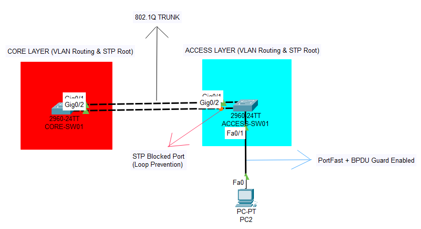
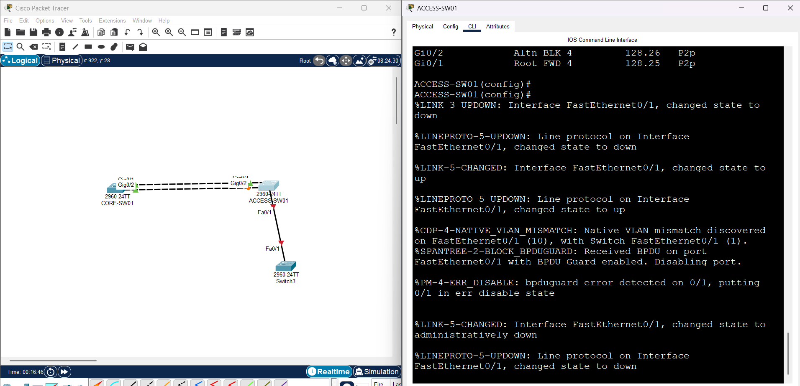

# Layer 2 Security Hardening & STP Optimization



## Project Overview
This project demonstrates a secure and optimized Layer 2 network infrastructure design simulating a corporate environment. The primary objective is to prevent **Man-in-the-Middle (MitM)** attacks via STP manipulation and to enhance network convergence times for end-users using **Cisco IOS**.

Key implementations include **Rapid-PVST+**, **Root Bridge Hardening**, and **Edge Port Security (BPDU Guard)**.

## Technical Stack & Protocols
* **Simulator:** Cisco Packet Tracer
* **Switching Protocols:** STP (802.1D), RSTP (802.1w), Rapid-PVST+
* **Security Features:** BPDU Guard, Port Security, Root Guard principles
* **Optimization:** PortFast, VLAN Segmentation (802.1Q)

## Architecture & Configuration
The network follows a hierarchical design with clear separation of roles:

### 1. Core Layer (CORE-SW01)
* **Role:** The immutable **Root Bridge** for all VLANs.
* **Configuration:** `spanning-tree vlan 10,99 root primary` macro used to force priority (Priority: 24576).
* **Purpose:** Ensures deterministic traffic flow and prevents sub-optimal routing.

### 2. Access Layer (ACCESS-SW01)
* **Role:** Edge connectivity for end-devices.
* **Configuration:** * `spanning-tree portfast`: Bypasses listening/learning states for instant connectivity on edge ports.
  * `spanning-tree bpduguard enable`: **Security Mechanism.** Immediately shuts down the port if a BPDU packet (unauthorized switch) is detected.

## Simulation & Verification Scenarios

### Scenario A: The "Rogue Switch" Attack
To simulate a hijacking attempt, an unauthorized switch was connected to a secure edge port (`Fa0/1`).

**Observation:**
The **BPDU Guard** mechanism immediately detected the superior BPDU frames and placed the interface into an `err-disabled` state to protect the topology.

> **Evidence of Attack Prevention:**
> 
> *Log Output:* `%SPANTREE-2-BLOCK_BPDUGUARD: Received BPDU on port Fa0/1... Disabling port.`

### Scenario B: Operational Recovery (Troubleshooting)
After the security violation, the port remained in `err-disabled` state (Red LED) even after removing the threat.

**Resolution Steps:**
1.  Administrator access required.
2.  Interface reset performed manually via CLI:
    ```bash
    ACCESS-SW01(config)# interface fa0/1
    ACCESS-SW01(config-if)# shutdown
    ACCESS-SW01(config-if)# no shutdown
    ```
3.  **Note:** In simulation environments (Packet Tracer), accelerating system time may be necessary to re-trigger STP calculations after a reset.

## Project Structure
* `configs/`: Contains raw `running-config` files for analysis.
* `assets/`: Screenshots of topology, verification commands, and logs.
* `L2_Security_Lab.pkt`: The source Packet Tracer file.

---
**Author:** Murat Efe Nalbant
*Networking Enthusiast

[LinkedIn Profile](https://www.linkedin.com/in/murat-efe-nalbant-554495332/)

